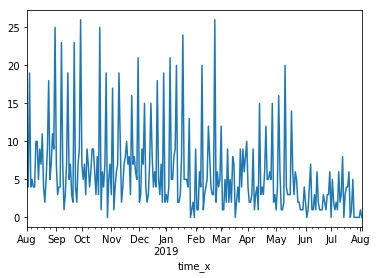
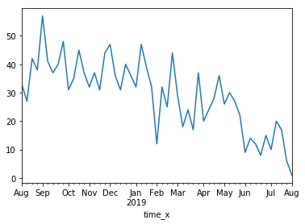
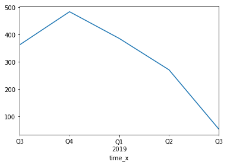
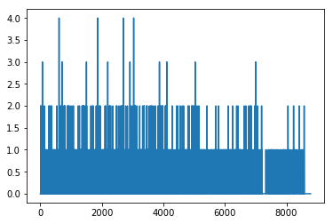
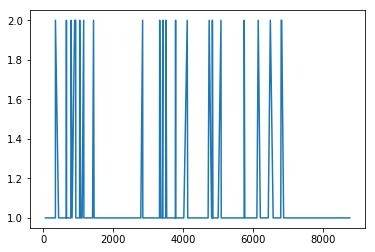
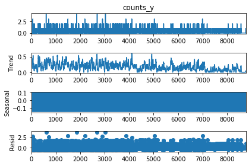
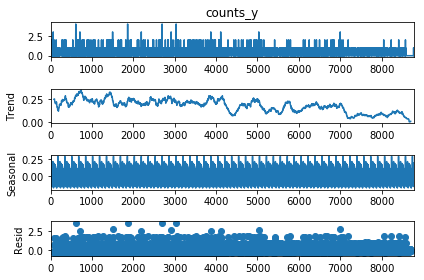
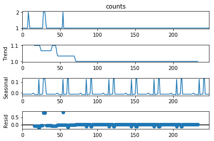

```python
##分析所有的事故，无论受伤或者没有人员受伤
import pandas as pd
dfa=pd.read_excel("/Users/apple/Desktop/2019科研/第二本交通工程方法研究基于python著作2019/排队模型投稿/accident_sample.xlsx")

dfa.head()
```


<div>
<style scoped>
    .dataframe tbody tr th:only-of-type {
        vertical-align: middle;
    }

    .dataframe tbody tr th {
        vertical-align: top;
    }

    .dataframe thead th {
        text-align: right;
    }
</style>
<table border="1" class="dataframe">
  <thead>
    <tr style="text-align: right;">
      <th></th>
      <th>name</th>
      <th>x</th>
      <th>y</th>
      <th>事故编号</th>
      <th>事故发生时间</th>
      <th>天气</th>
      <th>轻微伤人数</th>
      <th>事故认定原因</th>
      <th>事故认定原因分类</th>
      <th>事故责任</th>
      <th>星期</th>
      <th>交通方式分类</th>
    </tr>
  </thead>
  <tbody>
    <tr>
      <th>0</th>
      <td>2号航站楼前及周边道路T2高速分流处至T2停车楼西侧路口段4米</td>
      <td>116.589859</td>
      <td>40.079926</td>
      <td>1101225201600910</td>
      <td>2018-08-01 11:10:00</td>
      <td>晴</td>
      <td>0</td>
      <td>机动车通过无灯控或交警指挥的路口，不按交通标志、标线指示让优先通行的一方先行的</td>
      <td>未按规定让行</td>
      <td>全部</td>
      <td>星期一</td>
      <td>驾驶汽车</td>
    </tr>
    <tr>
      <th>1</th>
      <td>三号航站楼前及周边道路三号航站楼出发层4米</td>
      <td>116.614455</td>
      <td>40.054626</td>
      <td>1101223201600910</td>
      <td>2018-08-01 13:05:00</td>
      <td>晴</td>
      <td>0</td>
      <td>驾车时有其他妨碍安全行车的行为的</td>
      <td>其他影响安全行为</td>
      <td>全部</td>
      <td>星期一</td>
      <td>驾驶汽车</td>
    </tr>
    <tr>
      <th>2</th>
      <td>三号航站楼前及周边道路三号航站楼出发层4米</td>
      <td>116.614455</td>
      <td>40.054626</td>
      <td>1101221201600910</td>
      <td>2018-08-01 13:25:00</td>
      <td>晴</td>
      <td>0</td>
      <td>在禁止掉头或者禁止左转弯标志、标线的地点掉头的</td>
      <td>违法掉头</td>
      <td>主要</td>
      <td>星期一</td>
      <td>驾驶汽车</td>
    </tr>
    <tr>
      <th>3</th>
      <td>2号航站楼前及周边道路T2高速分流处至T2停车楼西侧路口段4米</td>
      <td>116.589859</td>
      <td>40.079926</td>
      <td>1101225201600940</td>
      <td>2018-08-01 14:00:00</td>
      <td>晴</td>
      <td>0</td>
      <td>机动车通过无灯控或交警指挥的路口，不按交通标志、标线指示让优先通行的一方先行的</td>
      <td>未按规定让行</td>
      <td>全部</td>
      <td>星期一</td>
      <td>驾驶汽车</td>
    </tr>
    <tr>
      <th>4</th>
      <td>三号航站楼前及周边道路三号航站楼出发层4米</td>
      <td>116.614455</td>
      <td>40.054626</td>
      <td>1101222201601000</td>
      <td>2018-08-01 14:30:00</td>
      <td>晴</td>
      <td>0</td>
      <td>在车门、车厢没有关好时行车的</td>
      <td>其他影响安全行为</td>
      <td>全部</td>
      <td>星期一</td>
      <td>驾驶汽车</td>
    </tr>
  </tbody>
</table>
</div>


```python
dfnew1=dfa["name"]+(dfa["事故发生时间"].dt.year).astype(str)+(dfa["事故发生时间"].dt.month).astype(str)+\
(dfa["事故发生时间"].dt.day).astype(str)+(dfa["事故发生时间"].dt.hour).astype(str)
print("\033[0;37;40m\tdfnew1:\033[0m",dfnew1)
print("---------------------")
dfnew2=dfnew1.to_frame()##dfnew1 is Series
dfnew2["time"]=dfa["事故发生时间"]
dfnew2["星期"]=dfa["星期"]
dfnew2["轻微伤人数"]=dfa["轻微伤人数"]
print("\033[0;37;40m\t新的包含时间列的dfnew2:\033[0m",dfnew2)
print("---------------------")
chooses=dfnew2[0].drop_duplicates().index
print("\033[0;37;40m\tchooses:\033[0m",chooses)
print("---------------------")
dfnew3=dfnew2.loc[chooses]
print("\033[0;37;40m\t删除重复项的dfnew3:\033[0m",dfnew3)
dfnew3.to_excel("delete_a.xls")
```

    	dfnew1: 0       2号航站楼前及周边道路T2高速分流处至T2停车楼西侧路口段4米20188111
    1                 三号航站楼前及周边道路三号航站楼出发层4米20188113
    2                 三号航站楼前及周边道路三号航站楼出发层4米20188113
    3       2号航站楼前及周边道路T2高速分流处至T2停车楼西侧路口段4米20188114
    4                 三号航站楼前及周边道路三号航站楼出发层4米20188114
                             ...                   
    1763                        二纬路二纬二经路口4米20197247
    1764                    首都机场华谊桥华谊桥西下口4米20197247
    1765                        二纬路二纬一经路口4米20197248
    1766                      海天路蓝海苑小区路口4米201972412
    1767              三号航站楼前及周边道路三号航站楼出发层4米20198112
    Length: 1768, dtype: object
    ---------------------
    	新的包含时间列的dfnew2:                                             0                time   星期  轻微伤人数
    0     2号航站楼前及周边道路T2高速分流处至T2停车楼西侧路口段4米20188111 2018-08-01 11:10:00  星期一      0
    1               三号航站楼前及周边道路三号航站楼出发层4米20188113 2018-08-01 13:05:00  星期一      0
    2               三号航站楼前及周边道路三号航站楼出发层4米20188113 2018-08-01 13:25:00  星期一      0
    3     2号航站楼前及周边道路T2高速分流处至T2停车楼西侧路口段4米20188114 2018-08-01 14:00:00  星期一      0
    4               三号航站楼前及周边道路三号航站楼出发层4米20188114 2018-08-01 14:30:00  星期一      0
    ...                                       ...                 ...  ...    ...
    1763                      二纬路二纬二经路口4米20197247 2019-07-24 07:20:00  星期一      0
    1764                  首都机场华谊桥华谊桥西下口4米20197247 2019-07-24 07:40:00  星期一      0
    1765                      二纬路二纬一经路口4米20197248 2019-07-24 08:00:00  星期一      0
    1766                    海天路蓝海苑小区路口4米201972412 2019-07-24 12:00:00  星期一      1
    1767            三号航站楼前及周边道路三号航站楼出发层4米20198112 2019-08-01 12:50:00  星期二      1
    
    [1768 rows x 4 columns]
    ---------------------
    	chooses: Int64Index([   0,    1,    3,    4,    5,    6,    7,    8,   10,   11,
                ...
                1758, 1759, 1760, 1761, 1762, 1763, 1764, 1765, 1766, 1767],
               dtype='int64', length=1558)
    ---------------------
    	删除重复项的dfnew3:                                             0                time   星期  轻微伤人数
    0     2号航站楼前及周边道路T2高速分流处至T2停车楼西侧路口段4米20188111 2018-08-01 11:10:00  星期一      0
    1               三号航站楼前及周边道路三号航站楼出发层4米20188113 2018-08-01 13:05:00  星期一      0
    3     2号航站楼前及周边道路T2高速分流处至T2停车楼西侧路口段4米20188114 2018-08-01 14:00:00  星期一      0
    4               三号航站楼前及周边道路三号航站楼出发层4米20188114 2018-08-01 14:30:00  星期一      0
    5                      航站楼联络线新专机楼路口4米20188115 2018-08-01 15:50:00  星期一      0
    ...                                       ...                 ...  ...    ...
    1763                      二纬路二纬二经路口4米20197247 2019-07-24 07:20:00  星期一      0
    1764                  首都机场华谊桥华谊桥西下口4米20197247 2019-07-24 07:40:00  星期一      0
    1765                      二纬路二纬一经路口4米20197248 2019-07-24 08:00:00  星期一      0
    1766                    海天路蓝海苑小区路口4米201972412 2019-07-24 12:00:00  星期一      1
    1767            三号航站楼前及周边道路三号航站楼出发层4米20198112 2019-08-01 12:50:00  星期二      1
    
    [1558 rows x 4 columns]


```python
##提取时间数字
import re
import numpy as np
hour_list=[]
for string in dfnew3[0].values:
    hour=re.findall("20\d+",string)
    hour_list.append(hour[0])#hour 是一个列表
print(len(hour_list))   
# new_ahour=df_1.drop(columns=["hour1"])
dfnew3["hour"]=hour_list
dfnew3.index=np.arange(0,len(hour_list),1)
dfnew3
```

    1558


<div>
<style scoped>
    .dataframe tbody tr th:only-of-type {
        vertical-align: middle;
    }

    .dataframe tbody tr th {
        vertical-align: top;
    }

    .dataframe thead th {
        text-align: right;
    }
</style>
<table border="1" class="dataframe">
  <thead>
    <tr style="text-align: right;">
      <th></th>
      <th>0</th>
      <th>time</th>
      <th>星期</th>
      <th>轻微伤人数</th>
      <th>hour</th>
    </tr>
  </thead>
  <tbody>
    <tr>
      <th>0</th>
      <td>2号航站楼前及周边道路T2高速分流处至T2停车楼西侧路口段4米20188111</td>
      <td>2018-08-01 11:10:00</td>
      <td>星期一</td>
      <td>0</td>
      <td>20188111</td>
    </tr>
    <tr>
      <th>1</th>
      <td>三号航站楼前及周边道路三号航站楼出发层4米20188113</td>
      <td>2018-08-01 13:05:00</td>
      <td>星期一</td>
      <td>0</td>
      <td>20188113</td>
    </tr>
    <tr>
      <th>2</th>
      <td>2号航站楼前及周边道路T2高速分流处至T2停车楼西侧路口段4米20188114</td>
      <td>2018-08-01 14:00:00</td>
      <td>星期一</td>
      <td>0</td>
      <td>20188114</td>
    </tr>
    <tr>
      <th>3</th>
      <td>三号航站楼前及周边道路三号航站楼出发层4米20188114</td>
      <td>2018-08-01 14:30:00</td>
      <td>星期一</td>
      <td>0</td>
      <td>20188114</td>
    </tr>
    <tr>
      <th>4</th>
      <td>航站楼联络线新专机楼路口4米20188115</td>
      <td>2018-08-01 15:50:00</td>
      <td>星期一</td>
      <td>0</td>
      <td>20188115</td>
    </tr>
    <tr>
      <th>...</th>
      <td>...</td>
      <td>...</td>
      <td>...</td>
      <td>...</td>
      <td>...</td>
    </tr>
    <tr>
      <th>1553</th>
      <td>二纬路二纬二经路口4米20197247</td>
      <td>2019-07-24 07:20:00</td>
      <td>星期一</td>
      <td>0</td>
      <td>20197247</td>
    </tr>
    <tr>
      <th>1554</th>
      <td>首都机场华谊桥华谊桥西下口4米20197247</td>
      <td>2019-07-24 07:40:00</td>
      <td>星期一</td>
      <td>0</td>
      <td>20197247</td>
    </tr>
    <tr>
      <th>1555</th>
      <td>二纬路二纬一经路口4米20197248</td>
      <td>2019-07-24 08:00:00</td>
      <td>星期一</td>
      <td>0</td>
      <td>20197248</td>
    </tr>
    <tr>
      <th>1556</th>
      <td>海天路蓝海苑小区路口4米201972412</td>
      <td>2019-07-24 12:00:00</td>
      <td>星期一</td>
      <td>1</td>
      <td>201972412</td>
    </tr>
    <tr>
      <th>1557</th>
      <td>三号航站楼前及周边道路三号航站楼出发层4米20198112</td>
      <td>2019-08-01 12:50:00</td>
      <td>星期二</td>
      <td>1</td>
      <td>20198112</td>
    </tr>
  </tbody>
</table>
<p>1558 rows × 5 columns</p>
</div>


```python
##计算总的counts
list_a=dfnew3["hour"].tolist()
# list_set = list(set(list_a)) #List_set是另外一个列表，里面的内容是List里面的无重复项
# print(list_set.sort(key=list_a))
list_a_item=[]
list_a_count=[]
for item in list_a:##试过很多方法包括value_counts，列表自带count函数，但发现序号都已经混乱，无法体现时间先后，最后用这种方法
     count=list_a.count(item)##即使使用set也会乱序
     list_a_item.append(item)
     list_a_count.append(count)
dfnew_ahour1=pd.DataFrame({"hour":list_a_item,"counts":list_a_count})
dfnew_ahour2=pd.DataFrame({"hour":list_a_item,"counts":list_a_count})
dfnew_ahour1
```


<div>
<style scoped>
    .dataframe tbody tr th:only-of-type {
        vertical-align: middle;
    }

    .dataframe tbody tr th {
        vertical-align: top;
    }

    .dataframe thead th {
        text-align: right;
    }
</style>
<table border="1" class="dataframe">
  <thead>
    <tr style="text-align: right;">
      <th></th>
      <th>hour</th>
      <th>counts</th>
    </tr>
  </thead>
  <tbody>
    <tr>
      <th>0</th>
      <td>20188111</td>
      <td>1</td>
    </tr>
    <tr>
      <th>1</th>
      <td>20188113</td>
      <td>1</td>
    </tr>
    <tr>
      <th>2</th>
      <td>20188114</td>
      <td>2</td>
    </tr>
    <tr>
      <th>3</th>
      <td>20188114</td>
      <td>2</td>
    </tr>
    <tr>
      <th>4</th>
      <td>20188115</td>
      <td>1</td>
    </tr>
    <tr>
      <th>...</th>
      <td>...</td>
      <td>...</td>
    </tr>
    <tr>
      <th>1553</th>
      <td>20197247</td>
      <td>2</td>
    </tr>
    <tr>
      <th>1554</th>
      <td>20197247</td>
      <td>2</td>
    </tr>
    <tr>
      <th>1555</th>
      <td>20197248</td>
      <td>1</td>
    </tr>
    <tr>
      <th>1556</th>
      <td>201972412</td>
      <td>1</td>
    </tr>
    <tr>
      <th>1557</th>
      <td>20198112</td>
      <td>1</td>
    </tr>
  </tbody>
</table>
<p>1558 rows × 2 columns</p>
</div>


```python
##加入其他列,这种方式产生的结果中有NaN
dfnew_ahour1["time"]=dfnew3["time"]
dfnew_ahour1["星期"]=dfnew3["星期"]
dfnew_ahour1["轻微伤人数"]=dfnew3["轻微伤人数"]
dfnew_ahour1
```


<div>
<style scoped>
    .dataframe tbody tr th:only-of-type {
        vertical-align: middle;
    }

    .dataframe tbody tr th {
        vertical-align: top;
    }

    .dataframe thead th {
        text-align: right;
    }
</style>
<table border="1" class="dataframe">
  <thead>
    <tr style="text-align: right;">
      <th></th>
      <th>hour</th>
      <th>counts</th>
      <th>time</th>
      <th>星期</th>
      <th>轻微伤人数</th>
    </tr>
  </thead>
  <tbody>
    <tr>
      <th>0</th>
      <td>20188111</td>
      <td>1</td>
      <td>2018-08-01 11:10:00</td>
      <td>星期一</td>
      <td>0</td>
    </tr>
    <tr>
      <th>1</th>
      <td>20188113</td>
      <td>1</td>
      <td>2018-08-01 13:05:00</td>
      <td>星期一</td>
      <td>0</td>
    </tr>
    <tr>
      <th>2</th>
      <td>20188114</td>
      <td>2</td>
      <td>2018-08-01 14:00:00</td>
      <td>星期一</td>
      <td>0</td>
    </tr>
    <tr>
      <th>3</th>
      <td>20188114</td>
      <td>2</td>
      <td>2018-08-01 14:30:00</td>
      <td>星期一</td>
      <td>0</td>
    </tr>
    <tr>
      <th>4</th>
      <td>20188115</td>
      <td>1</td>
      <td>2018-08-01 15:50:00</td>
      <td>星期一</td>
      <td>0</td>
    </tr>
    <tr>
      <th>...</th>
      <td>...</td>
      <td>...</td>
      <td>...</td>
      <td>...</td>
      <td>...</td>
    </tr>
    <tr>
      <th>1553</th>
      <td>20197247</td>
      <td>2</td>
      <td>2019-07-24 07:20:00</td>
      <td>星期一</td>
      <td>0</td>
    </tr>
    <tr>
      <th>1554</th>
      <td>20197247</td>
      <td>2</td>
      <td>2019-07-24 07:40:00</td>
      <td>星期一</td>
      <td>0</td>
    </tr>
    <tr>
      <th>1555</th>
      <td>20197248</td>
      <td>1</td>
      <td>2019-07-24 08:00:00</td>
      <td>星期一</td>
      <td>0</td>
    </tr>
    <tr>
      <th>1556</th>
      <td>201972412</td>
      <td>1</td>
      <td>2019-07-24 12:00:00</td>
      <td>星期一</td>
      <td>1</td>
    </tr>
    <tr>
      <th>1557</th>
      <td>20198112</td>
      <td>1</td>
      <td>2019-08-01 12:50:00</td>
      <td>星期二</td>
      <td>1</td>
    </tr>
  </tbody>
</table>
<p>1558 rows × 5 columns</p>
</div>


```python
dfnew_ahour2
```


<div>
<style scoped>
    .dataframe tbody tr th:only-of-type {
        vertical-align: middle;
    }

    .dataframe tbody tr th {
        vertical-align: top;
    }

    .dataframe thead th {
        text-align: right;
    }
</style>
<table border="1" class="dataframe">
  <thead>
    <tr style="text-align: right;">
      <th></th>
      <th>hour</th>
      <th>counts</th>
    </tr>
  </thead>
  <tbody>
    <tr>
      <th>0</th>
      <td>20188111</td>
      <td>1</td>
    </tr>
    <tr>
      <th>1</th>
      <td>20188113</td>
      <td>1</td>
    </tr>
    <tr>
      <th>2</th>
      <td>20188114</td>
      <td>2</td>
    </tr>
    <tr>
      <th>3</th>
      <td>20188114</td>
      <td>2</td>
    </tr>
    <tr>
      <th>4</th>
      <td>20188115</td>
      <td>1</td>
    </tr>
    <tr>
      <th>...</th>
      <td>...</td>
      <td>...</td>
    </tr>
    <tr>
      <th>1553</th>
      <td>20197247</td>
      <td>2</td>
    </tr>
    <tr>
      <th>1554</th>
      <td>20197247</td>
      <td>2</td>
    </tr>
    <tr>
      <th>1555</th>
      <td>20197248</td>
      <td>1</td>
    </tr>
    <tr>
      <th>1556</th>
      <td>201972412</td>
      <td>1</td>
    </tr>
    <tr>
      <th>1557</th>
      <td>20198112</td>
      <td>1</td>
    </tr>
  </tbody>
</table>
<p>1558 rows × 2 columns</p>
</div>


```python
##用merge函数成功了,成功之前把双方的index统一了，否则也出现了行数增加的错误（当在pd.merge函数中选择on=hour时出现的错误，估计是hour中有重复）
dfnew_ahour3=pd.merge(dfnew_ahour2,dfnew3,right_index=True,left_index=True)
dfnew_ahour3
```


<div>
<style scoped>
    .dataframe tbody tr th:only-of-type {
        vertical-align: middle;
    }

    .dataframe tbody tr th {
        vertical-align: top;
    }

    .dataframe thead th {
        text-align: right;
    }
</style>
<table border="1" class="dataframe">
  <thead>
    <tr style="text-align: right;">
      <th></th>
      <th>hour_x</th>
      <th>counts</th>
      <th>0</th>
      <th>time</th>
      <th>星期</th>
      <th>轻微伤人数</th>
      <th>hour_y</th>
    </tr>
  </thead>
  <tbody>
    <tr>
      <th>0</th>
      <td>20188111</td>
      <td>1</td>
      <td>2号航站楼前及周边道路T2高速分流处至T2停车楼西侧路口段4米20188111</td>
      <td>2018-08-01 11:10:00</td>
      <td>星期一</td>
      <td>0</td>
      <td>20188111</td>
    </tr>
    <tr>
      <th>1</th>
      <td>20188113</td>
      <td>1</td>
      <td>三号航站楼前及周边道路三号航站楼出发层4米20188113</td>
      <td>2018-08-01 13:05:00</td>
      <td>星期一</td>
      <td>0</td>
      <td>20188113</td>
    </tr>
    <tr>
      <th>2</th>
      <td>20188114</td>
      <td>2</td>
      <td>2号航站楼前及周边道路T2高速分流处至T2停车楼西侧路口段4米20188114</td>
      <td>2018-08-01 14:00:00</td>
      <td>星期一</td>
      <td>0</td>
      <td>20188114</td>
    </tr>
    <tr>
      <th>3</th>
      <td>20188114</td>
      <td>2</td>
      <td>三号航站楼前及周边道路三号航站楼出发层4米20188114</td>
      <td>2018-08-01 14:30:00</td>
      <td>星期一</td>
      <td>0</td>
      <td>20188114</td>
    </tr>
    <tr>
      <th>4</th>
      <td>20188115</td>
      <td>1</td>
      <td>航站楼联络线新专机楼路口4米20188115</td>
      <td>2018-08-01 15:50:00</td>
      <td>星期一</td>
      <td>0</td>
      <td>20188115</td>
    </tr>
    <tr>
      <th>...</th>
      <td>...</td>
      <td>...</td>
      <td>...</td>
      <td>...</td>
      <td>...</td>
      <td>...</td>
      <td>...</td>
    </tr>
    <tr>
      <th>1553</th>
      <td>20197247</td>
      <td>2</td>
      <td>二纬路二纬二经路口4米20197247</td>
      <td>2019-07-24 07:20:00</td>
      <td>星期一</td>
      <td>0</td>
      <td>20197247</td>
    </tr>
    <tr>
      <th>1554</th>
      <td>20197247</td>
      <td>2</td>
      <td>首都机场华谊桥华谊桥西下口4米20197247</td>
      <td>2019-07-24 07:40:00</td>
      <td>星期一</td>
      <td>0</td>
      <td>20197247</td>
    </tr>
    <tr>
      <th>1555</th>
      <td>20197248</td>
      <td>1</td>
      <td>二纬路二纬一经路口4米20197248</td>
      <td>2019-07-24 08:00:00</td>
      <td>星期一</td>
      <td>0</td>
      <td>20197248</td>
    </tr>
    <tr>
      <th>1556</th>
      <td>201972412</td>
      <td>1</td>
      <td>海天路蓝海苑小区路口4米201972412</td>
      <td>2019-07-24 12:00:00</td>
      <td>星期一</td>
      <td>1</td>
      <td>201972412</td>
    </tr>
    <tr>
      <th>1557</th>
      <td>20198112</td>
      <td>1</td>
      <td>三号航站楼前及周边道路三号航站楼出发层4米20198112</td>
      <td>2019-08-01 12:50:00</td>
      <td>星期二</td>
      <td>1</td>
      <td>20198112</td>
    </tr>
  </tbody>
</table>
<p>1558 rows × 7 columns</p>
</div>


```python
##选择重复的删除
chooses=dfnew_ahour3["hour_x"].drop_duplicates().index##唯有这个方法可以保持序列
new_ahour=dfnew_ahour3.loc[chooses]
new_ahour
```


<div>
<style scoped>
    .dataframe tbody tr th:only-of-type {
        vertical-align: middle;
    }

    .dataframe tbody tr th {
        vertical-align: top;
    }

    .dataframe thead th {
        text-align: right;
    }
</style>
<table border="1" class="dataframe">
  <thead>
    <tr style="text-align: right;">
      <th></th>
      <th>hour_x</th>
      <th>counts</th>
      <th>0</th>
      <th>time</th>
      <th>星期</th>
      <th>轻微伤人数</th>
      <th>hour_y</th>
    </tr>
  </thead>
  <tbody>
    <tr>
      <th>0</th>
      <td>20188111</td>
      <td>1</td>
      <td>2号航站楼前及周边道路T2高速分流处至T2停车楼西侧路口段4米20188111</td>
      <td>2018-08-01 11:10:00</td>
      <td>星期一</td>
      <td>0</td>
      <td>20188111</td>
    </tr>
    <tr>
      <th>1</th>
      <td>20188113</td>
      <td>1</td>
      <td>三号航站楼前及周边道路三号航站楼出发层4米20188113</td>
      <td>2018-08-01 13:05:00</td>
      <td>星期一</td>
      <td>0</td>
      <td>20188113</td>
    </tr>
    <tr>
      <th>2</th>
      <td>20188114</td>
      <td>2</td>
      <td>2号航站楼前及周边道路T2高速分流处至T2停车楼西侧路口段4米20188114</td>
      <td>2018-08-01 14:00:00</td>
      <td>星期一</td>
      <td>0</td>
      <td>20188114</td>
    </tr>
    <tr>
      <th>4</th>
      <td>20188115</td>
      <td>1</td>
      <td>航站楼联络线新专机楼路口4米20188115</td>
      <td>2018-08-01 15:50:00</td>
      <td>星期一</td>
      <td>0</td>
      <td>20188115</td>
    </tr>
    <tr>
      <th>5</th>
      <td>20188117</td>
      <td>1</td>
      <td>首都机场路老专机楼环岛路口至航平西路路口段4米20188117</td>
      <td>2018-08-01 17:30:00</td>
      <td>星期一</td>
      <td>0</td>
      <td>20188117</td>
    </tr>
    <tr>
      <th>...</th>
      <td>...</td>
      <td>...</td>
      <td>...</td>
      <td>...</td>
      <td>...</td>
      <td>...</td>
      <td>...</td>
    </tr>
    <tr>
      <th>1552</th>
      <td>20197246</td>
      <td>1</td>
      <td>机场货运北路国航地服路口至ＢＧＳ站坪路口段4米20197246</td>
      <td>2019-07-24 06:30:00</td>
      <td>星期一</td>
      <td>0</td>
      <td>20197246</td>
    </tr>
    <tr>
      <th>1553</th>
      <td>20197247</td>
      <td>2</td>
      <td>二纬路二纬二经路口4米20197247</td>
      <td>2019-07-24 07:20:00</td>
      <td>星期一</td>
      <td>0</td>
      <td>20197247</td>
    </tr>
    <tr>
      <th>1555</th>
      <td>20197248</td>
      <td>1</td>
      <td>二纬路二纬一经路口4米20197248</td>
      <td>2019-07-24 08:00:00</td>
      <td>星期一</td>
      <td>0</td>
      <td>20197248</td>
    </tr>
    <tr>
      <th>1556</th>
      <td>201972412</td>
      <td>1</td>
      <td>海天路蓝海苑小区路口4米201972412</td>
      <td>2019-07-24 12:00:00</td>
      <td>星期一</td>
      <td>1</td>
      <td>201972412</td>
    </tr>
    <tr>
      <th>1557</th>
      <td>20198112</td>
      <td>1</td>
      <td>三号航站楼前及周边道路三号航站楼出发层4米20198112</td>
      <td>2019-08-01 12:50:00</td>
      <td>星期二</td>
      <td>1</td>
      <td>20198112</td>
    </tr>
  </tbody>
</table>
<p>1371 rows × 7 columns</p>
</div>


```python
##生成小时段
import pandas as pd
all_hour=pd.date_range('20180801', '20190802',freq='1H') ##还有几个参数Y、M、D等
all_hour
```


    DatetimeIndex(['2018-08-01 00:00:00', '2018-08-01 01:00:00',
                   '2018-08-01 02:00:00', '2018-08-01 03:00:00',
                   '2018-08-01 04:00:00', '2018-08-01 05:00:00',
                   '2018-08-01 06:00:00', '2018-08-01 07:00:00',
                   '2018-08-01 08:00:00', '2018-08-01 09:00:00',
                   ...
                   '2019-08-01 15:00:00', '2019-08-01 16:00:00',
                   '2019-08-01 17:00:00', '2019-08-01 18:00:00',
                   '2019-08-01 19:00:00', '2019-08-01 20:00:00',
                   '2019-08-01 21:00:00', '2019-08-01 22:00:00',
                   '2019-08-01 23:00:00', '2019-08-02 00:00:00'],
                  dtype='datetime64[ns]', length=8785, freq='H')


```python
##生成count=0的DataFrame 
all_accidents=pd.DataFrame({"time":all_hour,'counts': np.zeros(len(all_hour),)})
all_accidents
```


<div>
<style scoped>
    .dataframe tbody tr th:only-of-type {
        vertical-align: middle;
    }

    .dataframe tbody tr th {
        vertical-align: top;
    }

    .dataframe thead th {
        text-align: right;
    }
</style>
<table border="1" class="dataframe">
  <thead>
    <tr style="text-align: right;">
      <th></th>
      <th>time</th>
      <th>counts</th>
    </tr>
  </thead>
  <tbody>
    <tr>
      <th>0</th>
      <td>2018-08-01 00:00:00</td>
      <td>0.0</td>
    </tr>
    <tr>
      <th>1</th>
      <td>2018-08-01 01:00:00</td>
      <td>0.0</td>
    </tr>
    <tr>
      <th>2</th>
      <td>2018-08-01 02:00:00</td>
      <td>0.0</td>
    </tr>
    <tr>
      <th>3</th>
      <td>2018-08-01 03:00:00</td>
      <td>0.0</td>
    </tr>
    <tr>
      <th>4</th>
      <td>2018-08-01 04:00:00</td>
      <td>0.0</td>
    </tr>
    <tr>
      <th>...</th>
      <td>...</td>
      <td>...</td>
    </tr>
    <tr>
      <th>8780</th>
      <td>2019-08-01 20:00:00</td>
      <td>0.0</td>
    </tr>
    <tr>
      <th>8781</th>
      <td>2019-08-01 21:00:00</td>
      <td>0.0</td>
    </tr>
    <tr>
      <th>8782</th>
      <td>2019-08-01 22:00:00</td>
      <td>0.0</td>
    </tr>
    <tr>
      <th>8783</th>
      <td>2019-08-01 23:00:00</td>
      <td>0.0</td>
    </tr>
    <tr>
      <th>8784</th>
      <td>2019-08-02 00:00:00</td>
      <td>0.0</td>
    </tr>
  </tbody>
</table>
<p>8785 rows × 2 columns</p>
</div>


```python
##改为日期到小时的格式，方便合并
import datetime
all_accidents["time_new"]=all_accidents["time"].apply(lambda x:datetime.datetime.strftime(x,'%Y-%m-%d %H'))##变为datetime型可以不用循环直接用pd.to_datetime(Series,format)
all_accidents["date"]=all_accidents["time"].apply(lambda x:datetime.datetime.strftime(x,'%Y-%m-%d'))##需要看看每天（freq=24）稳定性情况，用到函数gourpby（），首先需要将new_allac增加一列关于日期的，这样便于统计
all_accidents
```


<div>
<style scoped>
    .dataframe tbody tr th:only-of-type {
        vertical-align: middle;
    }

    .dataframe tbody tr th {
        vertical-align: top;
    }

    .dataframe thead th {
        text-align: right;
    }
</style>
<table border="1" class="dataframe">
  <thead>
    <tr style="text-align: right;">
      <th></th>
      <th>time</th>
      <th>counts</th>
      <th>time_new</th>
      <th>date</th>
    </tr>
  </thead>
  <tbody>
    <tr>
      <th>0</th>
      <td>2018-08-01 00:00:00</td>
      <td>0.0</td>
      <td>2018-08-01 00</td>
      <td>2018-08-01</td>
    </tr>
    <tr>
      <th>1</th>
      <td>2018-08-01 01:00:00</td>
      <td>0.0</td>
      <td>2018-08-01 01</td>
      <td>2018-08-01</td>
    </tr>
    <tr>
      <th>2</th>
      <td>2018-08-01 02:00:00</td>
      <td>0.0</td>
      <td>2018-08-01 02</td>
      <td>2018-08-01</td>
    </tr>
    <tr>
      <th>3</th>
      <td>2018-08-01 03:00:00</td>
      <td>0.0</td>
      <td>2018-08-01 03</td>
      <td>2018-08-01</td>
    </tr>
    <tr>
      <th>4</th>
      <td>2018-08-01 04:00:00</td>
      <td>0.0</td>
      <td>2018-08-01 04</td>
      <td>2018-08-01</td>
    </tr>
    <tr>
      <th>...</th>
      <td>...</td>
      <td>...</td>
      <td>...</td>
      <td>...</td>
    </tr>
    <tr>
      <th>8780</th>
      <td>2019-08-01 20:00:00</td>
      <td>0.0</td>
      <td>2019-08-01 20</td>
      <td>2019-08-01</td>
    </tr>
    <tr>
      <th>8781</th>
      <td>2019-08-01 21:00:00</td>
      <td>0.0</td>
      <td>2019-08-01 21</td>
      <td>2019-08-01</td>
    </tr>
    <tr>
      <th>8782</th>
      <td>2019-08-01 22:00:00</td>
      <td>0.0</td>
      <td>2019-08-01 22</td>
      <td>2019-08-01</td>
    </tr>
    <tr>
      <th>8783</th>
      <td>2019-08-01 23:00:00</td>
      <td>0.0</td>
      <td>2019-08-01 23</td>
      <td>2019-08-01</td>
    </tr>
    <tr>
      <th>8784</th>
      <td>2019-08-02 00:00:00</td>
      <td>0.0</td>
      <td>2019-08-02 00</td>
      <td>2019-08-02</td>
    </tr>
  </tbody>
</table>
<p>8785 rows × 4 columns</p>
</div>


```python
import datetime
# pd.to_datetime(new_ahour["time"],'%Y-%m-%d %H:%M:%S')
new_ahour["time_new"]=new_ahour["time"].apply(lambda x:datetime.datetime.strftime(x,'%Y-%m-%d %H'))
new_ahour
```


<div>
<style scoped>
    .dataframe tbody tr th:only-of-type {
        vertical-align: middle;
    }

    .dataframe tbody tr th {
        vertical-align: top;
    }

    .dataframe thead th {
        text-align: right;
    }
</style>
<table border="1" class="dataframe">
  <thead>
    <tr style="text-align: right;">
      <th></th>
      <th>hour_x</th>
      <th>counts</th>
      <th>0</th>
      <th>time</th>
      <th>星期</th>
      <th>轻微伤人数</th>
      <th>hour_y</th>
      <th>time_new</th>
    </tr>
  </thead>
  <tbody>
    <tr>
      <th>0</th>
      <td>20188111</td>
      <td>1</td>
      <td>2号航站楼前及周边道路T2高速分流处至T2停车楼西侧路口段4米20188111</td>
      <td>2018-08-01 11:10:00</td>
      <td>星期一</td>
      <td>0</td>
      <td>20188111</td>
      <td>2018-08-01 11</td>
    </tr>
    <tr>
      <th>1</th>
      <td>20188113</td>
      <td>1</td>
      <td>三号航站楼前及周边道路三号航站楼出发层4米20188113</td>
      <td>2018-08-01 13:05:00</td>
      <td>星期一</td>
      <td>0</td>
      <td>20188113</td>
      <td>2018-08-01 13</td>
    </tr>
    <tr>
      <th>2</th>
      <td>20188114</td>
      <td>2</td>
      <td>2号航站楼前及周边道路T2高速分流处至T2停车楼西侧路口段4米20188114</td>
      <td>2018-08-01 14:00:00</td>
      <td>星期一</td>
      <td>0</td>
      <td>20188114</td>
      <td>2018-08-01 14</td>
    </tr>
    <tr>
      <th>4</th>
      <td>20188115</td>
      <td>1</td>
      <td>航站楼联络线新专机楼路口4米20188115</td>
      <td>2018-08-01 15:50:00</td>
      <td>星期一</td>
      <td>0</td>
      <td>20188115</td>
      <td>2018-08-01 15</td>
    </tr>
    <tr>
      <th>5</th>
      <td>20188117</td>
      <td>1</td>
      <td>首都机场路老专机楼环岛路口至航平西路路口段4米20188117</td>
      <td>2018-08-01 17:30:00</td>
      <td>星期一</td>
      <td>0</td>
      <td>20188117</td>
      <td>2018-08-01 17</td>
    </tr>
    <tr>
      <th>...</th>
      <td>...</td>
      <td>...</td>
      <td>...</td>
      <td>...</td>
      <td>...</td>
      <td>...</td>
      <td>...</td>
      <td>...</td>
    </tr>
    <tr>
      <th>1552</th>
      <td>20197246</td>
      <td>1</td>
      <td>机场货运北路国航地服路口至ＢＧＳ站坪路口段4米20197246</td>
      <td>2019-07-24 06:30:00</td>
      <td>星期一</td>
      <td>0</td>
      <td>20197246</td>
      <td>2019-07-24 06</td>
    </tr>
    <tr>
      <th>1553</th>
      <td>20197247</td>
      <td>2</td>
      <td>二纬路二纬二经路口4米20197247</td>
      <td>2019-07-24 07:20:00</td>
      <td>星期一</td>
      <td>0</td>
      <td>20197247</td>
      <td>2019-07-24 07</td>
    </tr>
    <tr>
      <th>1555</th>
      <td>20197248</td>
      <td>1</td>
      <td>二纬路二纬一经路口4米20197248</td>
      <td>2019-07-24 08:00:00</td>
      <td>星期一</td>
      <td>0</td>
      <td>20197248</td>
      <td>2019-07-24 08</td>
    </tr>
    <tr>
      <th>1556</th>
      <td>201972412</td>
      <td>1</td>
      <td>海天路蓝海苑小区路口4米201972412</td>
      <td>2019-07-24 12:00:00</td>
      <td>星期一</td>
      <td>1</td>
      <td>201972412</td>
      <td>2019-07-24 12</td>
    </tr>
    <tr>
      <th>1557</th>
      <td>20198112</td>
      <td>1</td>
      <td>三号航站楼前及周边道路三号航站楼出发层4米20198112</td>
      <td>2019-08-01 12:50:00</td>
      <td>星期二</td>
      <td>1</td>
      <td>20198112</td>
      <td>2019-08-01 12</td>
    </tr>
  </tbody>
</table>
<p>1371 rows × 8 columns</p>
</div>


```python
new_allac=pd.merge(all_accidents,new_ahour,on="time_new",how="outer")##perfect，但是left和right次序不能改变，left可以理解为母体
new_allac[5:20]

```


<div>
<style scoped>
    .dataframe tbody tr th:only-of-type {
        vertical-align: middle;
    }

    .dataframe tbody tr th {
        vertical-align: top;
    }

    .dataframe thead th {
        text-align: right;
    }
</style>
<table border="1" class="dataframe">
  <thead>
    <tr style="text-align: right;">
      <th></th>
      <th>time_x</th>
      <th>counts_x</th>
      <th>time_new</th>
      <th>date</th>
      <th>hour_x</th>
      <th>counts_y</th>
      <th>0</th>
      <th>time_y</th>
      <th>星期</th>
      <th>轻微伤人数</th>
      <th>hour_y</th>
    </tr>
  </thead>
  <tbody>
    <tr>
      <th>5</th>
      <td>2018-08-01 05:00:00</td>
      <td>0.0</td>
      <td>2018-08-01 05</td>
      <td>2018-08-01</td>
      <td>NaN</td>
      <td>NaN</td>
      <td>NaN</td>
      <td>NaT</td>
      <td>NaN</td>
      <td>NaN</td>
      <td>NaN</td>
    </tr>
    <tr>
      <th>6</th>
      <td>2018-08-01 06:00:00</td>
      <td>0.0</td>
      <td>2018-08-01 06</td>
      <td>2018-08-01</td>
      <td>NaN</td>
      <td>NaN</td>
      <td>NaN</td>
      <td>NaT</td>
      <td>NaN</td>
      <td>NaN</td>
      <td>NaN</td>
    </tr>
    <tr>
      <th>7</th>
      <td>2018-08-01 07:00:00</td>
      <td>0.0</td>
      <td>2018-08-01 07</td>
      <td>2018-08-01</td>
      <td>NaN</td>
      <td>NaN</td>
      <td>NaN</td>
      <td>NaT</td>
      <td>NaN</td>
      <td>NaN</td>
      <td>NaN</td>
    </tr>
    <tr>
      <th>8</th>
      <td>2018-08-01 08:00:00</td>
      <td>0.0</td>
      <td>2018-08-01 08</td>
      <td>2018-08-01</td>
      <td>NaN</td>
      <td>NaN</td>
      <td>NaN</td>
      <td>NaT</td>
      <td>NaN</td>
      <td>NaN</td>
      <td>NaN</td>
    </tr>
    <tr>
      <th>9</th>
      <td>2018-08-01 09:00:00</td>
      <td>0.0</td>
      <td>2018-08-01 09</td>
      <td>2018-08-01</td>
      <td>NaN</td>
      <td>NaN</td>
      <td>NaN</td>
      <td>NaT</td>
      <td>NaN</td>
      <td>NaN</td>
      <td>NaN</td>
    </tr>
    <tr>
      <th>10</th>
      <td>2018-08-01 10:00:00</td>
      <td>0.0</td>
      <td>2018-08-01 10</td>
      <td>2018-08-01</td>
      <td>NaN</td>
      <td>NaN</td>
      <td>NaN</td>
      <td>NaT</td>
      <td>NaN</td>
      <td>NaN</td>
      <td>NaN</td>
    </tr>
    <tr>
      <th>11</th>
      <td>2018-08-01 11:00:00</td>
      <td>0.0</td>
      <td>2018-08-01 11</td>
      <td>2018-08-01</td>
      <td>20188111</td>
      <td>1.0</td>
      <td>2号航站楼前及周边道路T2高速分流处至T2停车楼西侧路口段4米20188111</td>
      <td>2018-08-01 11:10:00</td>
      <td>星期一</td>
      <td>0.0</td>
      <td>20188111</td>
    </tr>
    <tr>
      <th>12</th>
      <td>2018-08-01 12:00:00</td>
      <td>0.0</td>
      <td>2018-08-01 12</td>
      <td>2018-08-01</td>
      <td>NaN</td>
      <td>NaN</td>
      <td>NaN</td>
      <td>NaT</td>
      <td>NaN</td>
      <td>NaN</td>
      <td>NaN</td>
    </tr>
    <tr>
      <th>13</th>
      <td>2018-08-01 13:00:00</td>
      <td>0.0</td>
      <td>2018-08-01 13</td>
      <td>2018-08-01</td>
      <td>20188113</td>
      <td>1.0</td>
      <td>三号航站楼前及周边道路三号航站楼出发层4米20188113</td>
      <td>2018-08-01 13:05:00</td>
      <td>星期一</td>
      <td>0.0</td>
      <td>20188113</td>
    </tr>
    <tr>
      <th>14</th>
      <td>2018-08-01 14:00:00</td>
      <td>0.0</td>
      <td>2018-08-01 14</td>
      <td>2018-08-01</td>
      <td>20188114</td>
      <td>2.0</td>
      <td>2号航站楼前及周边道路T2高速分流处至T2停车楼西侧路口段4米20188114</td>
      <td>2018-08-01 14:00:00</td>
      <td>星期一</td>
      <td>0.0</td>
      <td>20188114</td>
    </tr>
    <tr>
      <th>15</th>
      <td>2018-08-01 15:00:00</td>
      <td>0.0</td>
      <td>2018-08-01 15</td>
      <td>2018-08-01</td>
      <td>20188115</td>
      <td>1.0</td>
      <td>航站楼联络线新专机楼路口4米20188115</td>
      <td>2018-08-01 15:50:00</td>
      <td>星期一</td>
      <td>0.0</td>
      <td>20188115</td>
    </tr>
    <tr>
      <th>16</th>
      <td>2018-08-01 16:00:00</td>
      <td>0.0</td>
      <td>2018-08-01 16</td>
      <td>2018-08-01</td>
      <td>NaN</td>
      <td>NaN</td>
      <td>NaN</td>
      <td>NaT</td>
      <td>NaN</td>
      <td>NaN</td>
      <td>NaN</td>
    </tr>
    <tr>
      <th>17</th>
      <td>2018-08-01 17:00:00</td>
      <td>0.0</td>
      <td>2018-08-01 17</td>
      <td>2018-08-01</td>
      <td>20188117</td>
      <td>1.0</td>
      <td>首都机场路老专机楼环岛路口至航平西路路口段4米20188117</td>
      <td>2018-08-01 17:30:00</td>
      <td>星期一</td>
      <td>0.0</td>
      <td>20188117</td>
    </tr>
    <tr>
      <th>18</th>
      <td>2018-08-01 18:00:00</td>
      <td>0.0</td>
      <td>2018-08-01 18</td>
      <td>2018-08-01</td>
      <td>20188118</td>
      <td>2.0</td>
      <td>四纬路四纬二经路口至机场南线高速入口路口段4米20188118</td>
      <td>2018-08-01 18:20:00</td>
      <td>星期一</td>
      <td>0.0</td>
      <td>20188118</td>
    </tr>
    <tr>
      <th>19</th>
      <td>2018-08-01 19:00:00</td>
      <td>0.0</td>
      <td>2018-08-01 19</td>
      <td>2018-08-01</td>
      <td>NaN</td>
      <td>NaN</td>
      <td>NaN</td>
      <td>NaT</td>
      <td>NaN</td>
      <td>NaN</td>
      <td>NaN</td>
    </tr>
  </tbody>
</table>
</div>


```python
new_allac["counts_y"].fillna(0,inplace=True)##将所有次数的NaN转变为0
new_allac["轻微伤人数"].fillna(0,inplace=True)##将所有轻微伤的NaN转变为0
new_allac[5:20]
```


<div>
<style scoped>
    .dataframe tbody tr th:only-of-type {
        vertical-align: middle;
    }

    .dataframe tbody tr th {
        vertical-align: top;
    }

    .dataframe thead th {
        text-align: right;
    }
</style>
<table border="1" class="dataframe">
  <thead>
    <tr style="text-align: right;">
      <th></th>
      <th>time_x</th>
      <th>counts_x</th>
      <th>time_new</th>
      <th>date</th>
      <th>hour_x</th>
      <th>counts_y</th>
      <th>0</th>
      <th>time_y</th>
      <th>星期</th>
      <th>轻微伤人数</th>
      <th>hour_y</th>
      <th>sum_counts</th>
    </tr>
  </thead>
  <tbody>
    <tr>
      <th>5</th>
      <td>2018-08-01 05:00:00</td>
      <td>0.0</td>
      <td>2018-08-01 05</td>
      <td>2018-08-01</td>
      <td>NaN</td>
      <td>0.0</td>
      <td>NaN</td>
      <td>NaT</td>
      <td>NaN</td>
      <td>0.0</td>
      <td>NaN</td>
      <td>0.0</td>
    </tr>
    <tr>
      <th>6</th>
      <td>2018-08-01 06:00:00</td>
      <td>0.0</td>
      <td>2018-08-01 06</td>
      <td>2018-08-01</td>
      <td>NaN</td>
      <td>0.0</td>
      <td>NaN</td>
      <td>NaT</td>
      <td>NaN</td>
      <td>0.0</td>
      <td>NaN</td>
      <td>0.0</td>
    </tr>
    <tr>
      <th>7</th>
      <td>2018-08-01 07:00:00</td>
      <td>0.0</td>
      <td>2018-08-01 07</td>
      <td>2018-08-01</td>
      <td>NaN</td>
      <td>0.0</td>
      <td>NaN</td>
      <td>NaT</td>
      <td>NaN</td>
      <td>0.0</td>
      <td>NaN</td>
      <td>0.0</td>
    </tr>
    <tr>
      <th>8</th>
      <td>2018-08-01 08:00:00</td>
      <td>0.0</td>
      <td>2018-08-01 08</td>
      <td>2018-08-01</td>
      <td>NaN</td>
      <td>0.0</td>
      <td>NaN</td>
      <td>NaT</td>
      <td>NaN</td>
      <td>0.0</td>
      <td>NaN</td>
      <td>0.0</td>
    </tr>
    <tr>
      <th>9</th>
      <td>2018-08-01 09:00:00</td>
      <td>0.0</td>
      <td>2018-08-01 09</td>
      <td>2018-08-01</td>
      <td>NaN</td>
      <td>0.0</td>
      <td>NaN</td>
      <td>NaT</td>
      <td>NaN</td>
      <td>0.0</td>
      <td>NaN</td>
      <td>0.0</td>
    </tr>
    <tr>
      <th>10</th>
      <td>2018-08-01 10:00:00</td>
      <td>0.0</td>
      <td>2018-08-01 10</td>
      <td>2018-08-01</td>
      <td>NaN</td>
      <td>0.0</td>
      <td>NaN</td>
      <td>NaT</td>
      <td>NaN</td>
      <td>0.0</td>
      <td>NaN</td>
      <td>0.0</td>
    </tr>
    <tr>
      <th>11</th>
      <td>2018-08-01 11:00:00</td>
      <td>0.0</td>
      <td>2018-08-01 11</td>
      <td>2018-08-01</td>
      <td>20188111</td>
      <td>1.0</td>
      <td>2号航站楼前及周边道路T2高速分流处至T2停车楼西侧路口段4米20188111</td>
      <td>2018-08-01 11:10:00</td>
      <td>星期一</td>
      <td>0.0</td>
      <td>20188111</td>
      <td>1.0</td>
    </tr>
    <tr>
      <th>12</th>
      <td>2018-08-01 12:00:00</td>
      <td>0.0</td>
      <td>2018-08-01 12</td>
      <td>2018-08-01</td>
      <td>NaN</td>
      <td>0.0</td>
      <td>NaN</td>
      <td>NaT</td>
      <td>NaN</td>
      <td>0.0</td>
      <td>NaN</td>
      <td>1.0</td>
    </tr>
    <tr>
      <th>13</th>
      <td>2018-08-01 13:00:00</td>
      <td>0.0</td>
      <td>2018-08-01 13</td>
      <td>2018-08-01</td>
      <td>20188113</td>
      <td>1.0</td>
      <td>三号航站楼前及周边道路三号航站楼出发层4米20188113</td>
      <td>2018-08-01 13:05:00</td>
      <td>星期一</td>
      <td>0.0</td>
      <td>20188113</td>
      <td>2.0</td>
    </tr>
    <tr>
      <th>14</th>
      <td>2018-08-01 14:00:00</td>
      <td>0.0</td>
      <td>2018-08-01 14</td>
      <td>2018-08-01</td>
      <td>20188114</td>
      <td>2.0</td>
      <td>2号航站楼前及周边道路T2高速分流处至T2停车楼西侧路口段4米20188114</td>
      <td>2018-08-01 14:00:00</td>
      <td>星期一</td>
      <td>0.0</td>
      <td>20188114</td>
      <td>4.0</td>
    </tr>
    <tr>
      <th>15</th>
      <td>2018-08-01 15:00:00</td>
      <td>0.0</td>
      <td>2018-08-01 15</td>
      <td>2018-08-01</td>
      <td>20188115</td>
      <td>1.0</td>
      <td>航站楼联络线新专机楼路口4米20188115</td>
      <td>2018-08-01 15:50:00</td>
      <td>星期一</td>
      <td>0.0</td>
      <td>20188115</td>
      <td>5.0</td>
    </tr>
    <tr>
      <th>16</th>
      <td>2018-08-01 16:00:00</td>
      <td>0.0</td>
      <td>2018-08-01 16</td>
      <td>2018-08-01</td>
      <td>NaN</td>
      <td>0.0</td>
      <td>NaN</td>
      <td>NaT</td>
      <td>NaN</td>
      <td>0.0</td>
      <td>NaN</td>
      <td>5.0</td>
    </tr>
    <tr>
      <th>17</th>
      <td>2018-08-01 17:00:00</td>
      <td>0.0</td>
      <td>2018-08-01 17</td>
      <td>2018-08-01</td>
      <td>20188117</td>
      <td>1.0</td>
      <td>首都机场路老专机楼环岛路口至航平西路路口段4米20188117</td>
      <td>2018-08-01 17:30:00</td>
      <td>星期一</td>
      <td>0.0</td>
      <td>20188117</td>
      <td>6.0</td>
    </tr>
    <tr>
      <th>18</th>
      <td>2018-08-01 18:00:00</td>
      <td>0.0</td>
      <td>2018-08-01 18</td>
      <td>2018-08-01</td>
      <td>20188118</td>
      <td>2.0</td>
      <td>四纬路四纬二经路口至机场南线高速入口路口段4米20188118</td>
      <td>2018-08-01 18:20:00</td>
      <td>星期一</td>
      <td>0.0</td>
      <td>20188118</td>
      <td>8.0</td>
    </tr>
    <tr>
      <th>19</th>
      <td>2018-08-01 19:00:00</td>
      <td>0.0</td>
      <td>2018-08-01 19</td>
      <td>2018-08-01</td>
      <td>NaN</td>
      <td>0.0</td>
      <td>NaN</td>
      <td>NaT</td>
      <td>NaN</td>
      <td>0.0</td>
      <td>NaN</td>
      <td>8.0</td>
    </tr>
  </tbody>
</table>
</div>


```python
from statsmodels.tsa.stattools import adfuller
import statsmodels.api as sm
import matplotlib.pyplot as plt
dftest=adfuller(new_allac["counts_y"])
dftest
```


    (-12.35760571780176,
     5.640085630299868e-23,
     33,
     8751,
     {'1%': -3.4310974824840628,
      '5%': -2.861870337601791,
      '10%': -2.5669458337323605},
     10288.959386725914)


```python
##用到函数gourpby（）后来发现用时间重组法，即resample函数比这个方便太多，前提是将index设置为datetime格式及时间内容
new_allac["sum_counts"]=new_allac['counts_y'].groupby(new_allac['date']).cumsum()
new_allac[22:25]
```


<div>
<style scoped>
    .dataframe tbody tr th:only-of-type {
        vertical-align: middle;
    }

    .dataframe tbody tr th {
        vertical-align: top;
    }

    .dataframe thead th {
        text-align: right;
    }
</style>
<table border="1" class="dataframe">
  <thead>
    <tr style="text-align: right;">
      <th></th>
      <th>time_x</th>
      <th>counts_x</th>
      <th>time_new</th>
      <th>date</th>
      <th>hour_x</th>
      <th>counts_y</th>
      <th>0</th>
      <th>time_y</th>
      <th>星期</th>
      <th>轻微伤人数</th>
      <th>hour_y</th>
      <th>sum_counts</th>
    </tr>
  </thead>
  <tbody>
    <tr>
      <th>22</th>
      <td>2018-08-01 22:00:00</td>
      <td>0.0</td>
      <td>2018-08-01 22</td>
      <td>2018-08-01</td>
      <td>NaN</td>
      <td>0.0</td>
      <td>NaN</td>
      <td>NaT</td>
      <td>NaN</td>
      <td>0.0</td>
      <td>NaN</td>
      <td>10.0</td>
    </tr>
    <tr>
      <th>23</th>
      <td>2018-08-01 23:00:00</td>
      <td>0.0</td>
      <td>2018-08-01 23</td>
      <td>2018-08-01</td>
      <td>NaN</td>
      <td>0.0</td>
      <td>NaN</td>
      <td>NaT</td>
      <td>NaN</td>
      <td>0.0</td>
      <td>NaN</td>
      <td>10.0</td>
    </tr>
    <tr>
      <th>24</th>
      <td>2018-08-02 00:00:00</td>
      <td>0.0</td>
      <td>2018-08-02 00</td>
      <td>2018-08-02</td>
      <td>NaN</td>
      <td>0.0</td>
      <td>NaN</td>
      <td>NaT</td>
      <td>NaN</td>
      <td>0.0</td>
      <td>NaN</td>
      <td>0.0</td>
    </tr>
  </tbody>
</table>
</div>


```python
#将改好格式的date列,设置为new_allac的index
new_allac.time_x = pd.to_datetime(new_allac.time_x,format="%Y%m%d %H:%M:%S")
new_allac1=new_allac.set_index('time_x')
new_allac1
```


<div>
<style scoped>
    .dataframe tbody tr th:only-of-type {
        vertical-align: middle;
    }

    .dataframe tbody tr th {
        vertical-align: top;
    }

    .dataframe thead th {
        text-align: right;
    }
</style>
<table border="1" class="dataframe">
  <thead>
    <tr style="text-align: right;">
      <th></th>
      <th>counts_x</th>
      <th>time_new</th>
      <th>date</th>
      <th>hour_x</th>
      <th>counts_y</th>
      <th>0</th>
      <th>time_y</th>
      <th>星期</th>
      <th>轻微伤人数</th>
      <th>hour_y</th>
      <th>sum_counts</th>
    </tr>
    <tr>
      <th>time_x</th>
      <th></th>
      <th></th>
      <th></th>
      <th></th>
      <th></th>
      <th></th>
      <th></th>
      <th></th>
      <th></th>
      <th></th>
      <th></th>
    </tr>
  </thead>
  <tbody>
    <tr>
      <th>2018-08-01 00:00:00</th>
      <td>0.0</td>
      <td>2018-08-01 00</td>
      <td>2018-08-01</td>
      <td>NaN</td>
      <td>0.0</td>
      <td>NaN</td>
      <td>NaT</td>
      <td>NaN</td>
      <td>0.0</td>
      <td>NaN</td>
      <td>0.0</td>
    </tr>
    <tr>
      <th>2018-08-01 01:00:00</th>
      <td>0.0</td>
      <td>2018-08-01 01</td>
      <td>2018-08-01</td>
      <td>NaN</td>
      <td>0.0</td>
      <td>NaN</td>
      <td>NaT</td>
      <td>NaN</td>
      <td>0.0</td>
      <td>NaN</td>
      <td>0.0</td>
    </tr>
    <tr>
      <th>2018-08-01 02:00:00</th>
      <td>0.0</td>
      <td>2018-08-01 02</td>
      <td>2018-08-01</td>
      <td>NaN</td>
      <td>0.0</td>
      <td>NaN</td>
      <td>NaT</td>
      <td>NaN</td>
      <td>0.0</td>
      <td>NaN</td>
      <td>0.0</td>
    </tr>
    <tr>
      <th>2018-08-01 03:00:00</th>
      <td>0.0</td>
      <td>2018-08-01 03</td>
      <td>2018-08-01</td>
      <td>NaN</td>
      <td>0.0</td>
      <td>NaN</td>
      <td>NaT</td>
      <td>NaN</td>
      <td>0.0</td>
      <td>NaN</td>
      <td>0.0</td>
    </tr>
    <tr>
      <th>2018-08-01 04:00:00</th>
      <td>0.0</td>
      <td>2018-08-01 04</td>
      <td>2018-08-01</td>
      <td>NaN</td>
      <td>0.0</td>
      <td>NaN</td>
      <td>NaT</td>
      <td>NaN</td>
      <td>0.0</td>
      <td>NaN</td>
      <td>0.0</td>
    </tr>
    <tr>
      <th>...</th>
      <td>...</td>
      <td>...</td>
      <td>...</td>
      <td>...</td>
      <td>...</td>
      <td>...</td>
      <td>...</td>
      <td>...</td>
      <td>...</td>
      <td>...</td>
      <td>...</td>
    </tr>
    <tr>
      <th>2019-08-01 20:00:00</th>
      <td>0.0</td>
      <td>2019-08-01 20</td>
      <td>2019-08-01</td>
      <td>NaN</td>
      <td>0.0</td>
      <td>NaN</td>
      <td>NaT</td>
      <td>NaN</td>
      <td>0.0</td>
      <td>NaN</td>
      <td>1.0</td>
    </tr>
    <tr>
      <th>2019-08-01 21:00:00</th>
      <td>0.0</td>
      <td>2019-08-01 21</td>
      <td>2019-08-01</td>
      <td>NaN</td>
      <td>0.0</td>
      <td>NaN</td>
      <td>NaT</td>
      <td>NaN</td>
      <td>0.0</td>
      <td>NaN</td>
      <td>1.0</td>
    </tr>
    <tr>
      <th>2019-08-01 22:00:00</th>
      <td>0.0</td>
      <td>2019-08-01 22</td>
      <td>2019-08-01</td>
      <td>NaN</td>
      <td>0.0</td>
      <td>NaN</td>
      <td>NaT</td>
      <td>NaN</td>
      <td>0.0</td>
      <td>NaN</td>
      <td>1.0</td>
    </tr>
    <tr>
      <th>2019-08-01 23:00:00</th>
      <td>0.0</td>
      <td>2019-08-01 23</td>
      <td>2019-08-01</td>
      <td>NaN</td>
      <td>0.0</td>
      <td>NaN</td>
      <td>NaT</td>
      <td>NaN</td>
      <td>0.0</td>
      <td>NaN</td>
      <td>1.0</td>
    </tr>
    <tr>
      <th>2019-08-02 00:00:00</th>
      <td>0.0</td>
      <td>2019-08-02 00</td>
      <td>2019-08-02</td>
      <td>NaN</td>
      <td>0.0</td>
      <td>NaN</td>
      <td>NaT</td>
      <td>NaN</td>
      <td>0.0</td>
      <td>NaN</td>
      <td>0.0</td>
    </tr>
  </tbody>
</table>
<p>8785 rows × 11 columns</p>
</div>


```python
new_allac1["2018-08-01":"2019-05-01"]##选择某个时间段
```


<div>
<style scoped>
    .dataframe tbody tr th:only-of-type {
        vertical-align: middle;
    }

    .dataframe tbody tr th {
        vertical-align: top;
    }

    .dataframe thead th {
        text-align: right;
    }
</style>
<table border="1" class="dataframe">
  <thead>
    <tr style="text-align: right;">
      <th></th>
      <th>counts_x</th>
      <th>time_new</th>
      <th>date</th>
      <th>hour_x</th>
      <th>counts_y</th>
      <th>0</th>
      <th>time_y</th>
      <th>星期</th>
      <th>轻微伤人数</th>
      <th>hour_y</th>
      <th>sum_counts</th>
    </tr>
    <tr>
      <th>time_x</th>
      <th></th>
      <th></th>
      <th></th>
      <th></th>
      <th></th>
      <th></th>
      <th></th>
      <th></th>
      <th></th>
      <th></th>
      <th></th>
    </tr>
  </thead>
  <tbody>
    <tr>
      <th>2018-08-01 00:00:00</th>
      <td>0.0</td>
      <td>2018-08-01 00</td>
      <td>2018-08-01</td>
      <td>NaN</td>
      <td>0.0</td>
      <td>NaN</td>
      <td>NaT</td>
      <td>NaN</td>
      <td>0.0</td>
      <td>NaN</td>
      <td>0.0</td>
    </tr>
    <tr>
      <th>2018-08-01 01:00:00</th>
      <td>0.0</td>
      <td>2018-08-01 01</td>
      <td>2018-08-01</td>
      <td>NaN</td>
      <td>0.0</td>
      <td>NaN</td>
      <td>NaT</td>
      <td>NaN</td>
      <td>0.0</td>
      <td>NaN</td>
      <td>0.0</td>
    </tr>
    <tr>
      <th>2018-08-01 02:00:00</th>
      <td>0.0</td>
      <td>2018-08-01 02</td>
      <td>2018-08-01</td>
      <td>NaN</td>
      <td>0.0</td>
      <td>NaN</td>
      <td>NaT</td>
      <td>NaN</td>
      <td>0.0</td>
      <td>NaN</td>
      <td>0.0</td>
    </tr>
    <tr>
      <th>2018-08-01 03:00:00</th>
      <td>0.0</td>
      <td>2018-08-01 03</td>
      <td>2018-08-01</td>
      <td>NaN</td>
      <td>0.0</td>
      <td>NaN</td>
      <td>NaT</td>
      <td>NaN</td>
      <td>0.0</td>
      <td>NaN</td>
      <td>0.0</td>
    </tr>
    <tr>
      <th>2018-08-01 04:00:00</th>
      <td>0.0</td>
      <td>2018-08-01 04</td>
      <td>2018-08-01</td>
      <td>NaN</td>
      <td>0.0</td>
      <td>NaN</td>
      <td>NaT</td>
      <td>NaN</td>
      <td>0.0</td>
      <td>NaN</td>
      <td>0.0</td>
    </tr>
    <tr>
      <th>...</th>
      <td>...</td>
      <td>...</td>
      <td>...</td>
      <td>...</td>
      <td>...</td>
      <td>...</td>
      <td>...</td>
      <td>...</td>
      <td>...</td>
      <td>...</td>
      <td>...</td>
    </tr>
    <tr>
      <th>2019-05-01 19:00:00</th>
      <td>0.0</td>
      <td>2019-05-01 19</td>
      <td>2019-05-01</td>
      <td>NaN</td>
      <td>0.0</td>
      <td>NaN</td>
      <td>NaT</td>
      <td>NaN</td>
      <td>0.0</td>
      <td>NaN</td>
      <td>1.0</td>
    </tr>
    <tr>
      <th>2019-05-01 20:00:00</th>
      <td>0.0</td>
      <td>2019-05-01 20</td>
      <td>2019-05-01</td>
      <td>NaN</td>
      <td>0.0</td>
      <td>NaN</td>
      <td>NaT</td>
      <td>NaN</td>
      <td>0.0</td>
      <td>NaN</td>
      <td>1.0</td>
    </tr>
    <tr>
      <th>2019-05-01 21:00:00</th>
      <td>0.0</td>
      <td>2019-05-01 21</td>
      <td>2019-05-01</td>
      <td>NaN</td>
      <td>0.0</td>
      <td>NaN</td>
      <td>NaT</td>
      <td>NaN</td>
      <td>0.0</td>
      <td>NaN</td>
      <td>1.0</td>
    </tr>
    <tr>
      <th>2019-05-01 22:00:00</th>
      <td>0.0</td>
      <td>2019-05-01 22</td>
      <td>2019-05-01</td>
      <td>NaN</td>
      <td>0.0</td>
      <td>NaN</td>
      <td>NaT</td>
      <td>NaN</td>
      <td>0.0</td>
      <td>NaN</td>
      <td>1.0</td>
    </tr>
    <tr>
      <th>2019-05-01 23:00:00</th>
      <td>0.0</td>
      <td>2019-05-01 23</td>
      <td>2019-05-01</td>
      <td>NaN</td>
      <td>0.0</td>
      <td>NaN</td>
      <td>NaT</td>
      <td>NaN</td>
      <td>0.0</td>
      <td>NaN</td>
      <td>1.0</td>
    </tr>
  </tbody>
</table>
<p>6576 rows × 11 columns</p>
</div>


```python
allac_B=new_allac1.resample('B').sum()##按星期
allac_B
```


<div>
<style scoped>
    .dataframe tbody tr th:only-of-type {
        vertical-align: middle;
    }

    .dataframe tbody tr th {
        vertical-align: top;
    }

    .dataframe thead th {
        text-align: right;
    }
</style>
<table border="1" class="dataframe">
  <thead>
    <tr style="text-align: right;">
      <th></th>
      <th>counts_x</th>
      <th>counts_y</th>
      <th>轻微伤人数</th>
      <th>sum_counts</th>
    </tr>
    <tr>
      <th>time_x</th>
      <th></th>
      <th></th>
      <th></th>
      <th></th>
    </tr>
  </thead>
  <tbody>
    <tr>
      <th>2018-08-01</th>
      <td>0.0</td>
      <td>10.0</td>
      <td>0.0</td>
      <td>80.0</td>
    </tr>
    <tr>
      <th>2018-08-02</th>
      <td>0.0</td>
      <td>4.0</td>
      <td>0.0</td>
      <td>43.0</td>
    </tr>
    <tr>
      <th>2018-08-03</th>
      <td>0.0</td>
      <td>19.0</td>
      <td>6.0</td>
      <td>205.0</td>
    </tr>
    <tr>
      <th>2018-08-06</th>
      <td>0.0</td>
      <td>4.0</td>
      <td>0.0</td>
      <td>36.0</td>
    </tr>
    <tr>
      <th>2018-08-07</th>
      <td>0.0</td>
      <td>5.0</td>
      <td>0.0</td>
      <td>46.0</td>
    </tr>
    <tr>
      <th>...</th>
      <td>...</td>
      <td>...</td>
      <td>...</td>
      <td>...</td>
    </tr>
    <tr>
      <th>2019-07-29</th>
      <td>0.0</td>
      <td>0.0</td>
      <td>0.0</td>
      <td>0.0</td>
    </tr>
    <tr>
      <th>2019-07-30</th>
      <td>0.0</td>
      <td>0.0</td>
      <td>0.0</td>
      <td>0.0</td>
    </tr>
    <tr>
      <th>2019-07-31</th>
      <td>0.0</td>
      <td>0.0</td>
      <td>0.0</td>
      <td>0.0</td>
    </tr>
    <tr>
      <th>2019-08-01</th>
      <td>0.0</td>
      <td>1.0</td>
      <td>1.0</td>
      <td>12.0</td>
    </tr>
    <tr>
      <th>2019-08-02</th>
      <td>0.0</td>
      <td>0.0</td>
      <td>0.0</td>
      <td>0.0</td>
    </tr>
  </tbody>
</table>
<p>263 rows × 4 columns</p>
</div>


```python
##工作日的稳定性
dftest=adfuller(allac_B["counts_y"])
dftest
```


    (-0.9696059084560122,
     0.7641878372905884,
     15,
     247,
     {'1%': -3.457105309726321,
      '5%': -2.873313676101283,
      '10%': -2.5730443824681606},
     1337.1030846483202)


```python
allac_B["counts_y"].plot()
plt.show()
```





```python
allac_w=new_allac1.resample('W').sum()##按星期
allac_w
```


<div>
<style scoped>
    .dataframe tbody tr th:only-of-type {
        vertical-align: middle;
    }

    .dataframe tbody tr th {
        vertical-align: top;
    }

    .dataframe thead th {
        text-align: right;
    }
</style>
<table border="1" class="dataframe">
  <thead>
    <tr style="text-align: right;">
      <th></th>
      <th>counts_x</th>
      <th>counts_y</th>
      <th>轻微伤人数</th>
      <th>sum_counts</th>
    </tr>
    <tr>
      <th>time_x</th>
      <th></th>
      <th></th>
      <th></th>
      <th></th>
    </tr>
  </thead>
  <tbody>
    <tr>
      <th>2018-08-05</th>
      <td>0.0</td>
      <td>33.0</td>
      <td>6.0</td>
      <td>328.0</td>
    </tr>
    <tr>
      <th>2018-08-12</th>
      <td>0.0</td>
      <td>27.0</td>
      <td>2.0</td>
      <td>261.0</td>
    </tr>
    <tr>
      <th>2018-08-19</th>
      <td>0.0</td>
      <td>42.0</td>
      <td>3.0</td>
      <td>504.0</td>
    </tr>
    <tr>
      <th>2018-08-26</th>
      <td>0.0</td>
      <td>38.0</td>
      <td>3.0</td>
      <td>455.0</td>
    </tr>
    <tr>
      <th>2018-09-02</th>
      <td>0.0</td>
      <td>57.0</td>
      <td>8.0</td>
      <td>662.0</td>
    </tr>
    <tr>
      <th>2018-09-09</th>
      <td>0.0</td>
      <td>41.0</td>
      <td>6.0</td>
      <td>440.0</td>
    </tr>
    <tr>
      <th>2018-09-16</th>
      <td>0.0</td>
      <td>37.0</td>
      <td>6.0</td>
      <td>393.0</td>
    </tr>
    <tr>
      <th>2018-09-23</th>
      <td>0.0</td>
      <td>40.0</td>
      <td>5.0</td>
      <td>524.0</td>
    </tr>
    <tr>
      <th>2018-09-30</th>
      <td>0.0</td>
      <td>48.0</td>
      <td>10.0</td>
      <td>479.0</td>
    </tr>
    <tr>
      <th>2018-10-07</th>
      <td>0.0</td>
      <td>31.0</td>
      <td>2.0</td>
      <td>373.0</td>
    </tr>
    <tr>
      <th>2018-10-14</th>
      <td>0.0</td>
      <td>35.0</td>
      <td>5.0</td>
      <td>398.0</td>
    </tr>
    <tr>
      <th>2018-10-21</th>
      <td>0.0</td>
      <td>45.0</td>
      <td>3.0</td>
      <td>476.0</td>
    </tr>
    <tr>
      <th>2018-10-28</th>
      <td>0.0</td>
      <td>37.0</td>
      <td>5.0</td>
      <td>404.0</td>
    </tr>
    <tr>
      <th>2018-11-04</th>
      <td>0.0</td>
      <td>32.0</td>
      <td>5.0</td>
      <td>339.0</td>
    </tr>
    <tr>
      <th>2018-11-11</th>
      <td>0.0</td>
      <td>37.0</td>
      <td>3.0</td>
      <td>433.0</td>
    </tr>
    <tr>
      <th>2018-11-18</th>
      <td>0.0</td>
      <td>31.0</td>
      <td>4.0</td>
      <td>300.0</td>
    </tr>
    <tr>
      <th>2018-11-25</th>
      <td>0.0</td>
      <td>44.0</td>
      <td>2.0</td>
      <td>545.0</td>
    </tr>
    <tr>
      <th>2018-12-02</th>
      <td>0.0</td>
      <td>47.0</td>
      <td>4.0</td>
      <td>514.0</td>
    </tr>
    <tr>
      <th>2018-12-09</th>
      <td>0.0</td>
      <td>36.0</td>
      <td>3.0</td>
      <td>386.0</td>
    </tr>
    <tr>
      <th>2018-12-16</th>
      <td>0.0</td>
      <td>31.0</td>
      <td>7.0</td>
      <td>304.0</td>
    </tr>
    <tr>
      <th>2018-12-23</th>
      <td>0.0</td>
      <td>40.0</td>
      <td>11.0</td>
      <td>421.0</td>
    </tr>
    <tr>
      <th>2018-12-30</th>
      <td>0.0</td>
      <td>36.0</td>
      <td>6.0</td>
      <td>419.0</td>
    </tr>
    <tr>
      <th>2019-01-06</th>
      <td>0.0</td>
      <td>32.0</td>
      <td>9.0</td>
      <td>336.0</td>
    </tr>
    <tr>
      <th>2019-01-13</th>
      <td>0.0</td>
      <td>47.0</td>
      <td>3.0</td>
      <td>547.0</td>
    </tr>
    <tr>
      <th>2019-01-20</th>
      <td>0.0</td>
      <td>39.0</td>
      <td>3.0</td>
      <td>453.0</td>
    </tr>
    <tr>
      <th>2019-01-27</th>
      <td>0.0</td>
      <td>32.0</td>
      <td>10.0</td>
      <td>356.0</td>
    </tr>
    <tr>
      <th>2019-02-03</th>
      <td>0.0</td>
      <td>12.0</td>
      <td>0.0</td>
      <td>157.0</td>
    </tr>
    <tr>
      <th>2019-02-10</th>
      <td>0.0</td>
      <td>32.0</td>
      <td>5.0</td>
      <td>341.0</td>
    </tr>
    <tr>
      <th>2019-02-17</th>
      <td>0.0</td>
      <td>25.0</td>
      <td>3.0</td>
      <td>203.0</td>
    </tr>
    <tr>
      <th>2019-02-24</th>
      <td>0.0</td>
      <td>44.0</td>
      <td>8.0</td>
      <td>547.0</td>
    </tr>
    <tr>
      <th>2019-03-03</th>
      <td>0.0</td>
      <td>29.0</td>
      <td>3.0</td>
      <td>295.0</td>
    </tr>
    <tr>
      <th>2019-03-10</th>
      <td>0.0</td>
      <td>18.0</td>
      <td>0.0</td>
      <td>236.0</td>
    </tr>
    <tr>
      <th>2019-03-17</th>
      <td>0.0</td>
      <td>24.0</td>
      <td>4.0</td>
      <td>321.0</td>
    </tr>
    <tr>
      <th>2019-03-24</th>
      <td>0.0</td>
      <td>17.0</td>
      <td>3.0</td>
      <td>202.0</td>
    </tr>
    <tr>
      <th>2019-03-31</th>
      <td>0.0</td>
      <td>37.0</td>
      <td>9.0</td>
      <td>377.0</td>
    </tr>
    <tr>
      <th>2019-04-07</th>
      <td>0.0</td>
      <td>20.0</td>
      <td>2.0</td>
      <td>245.0</td>
    </tr>
    <tr>
      <th>2019-04-14</th>
      <td>0.0</td>
      <td>24.0</td>
      <td>3.0</td>
      <td>276.0</td>
    </tr>
    <tr>
      <th>2019-04-21</th>
      <td>0.0</td>
      <td>28.0</td>
      <td>3.0</td>
      <td>346.0</td>
    </tr>
    <tr>
      <th>2019-04-28</th>
      <td>0.0</td>
      <td>36.0</td>
      <td>5.0</td>
      <td>388.0</td>
    </tr>
    <tr>
      <th>2019-05-05</th>
      <td>0.0</td>
      <td>26.0</td>
      <td>3.0</td>
      <td>330.0</td>
    </tr>
    <tr>
      <th>2019-05-12</th>
      <td>0.0</td>
      <td>30.0</td>
      <td>7.0</td>
      <td>354.0</td>
    </tr>
    <tr>
      <th>2019-05-19</th>
      <td>0.0</td>
      <td>27.0</td>
      <td>7.0</td>
      <td>316.0</td>
    </tr>
    <tr>
      <th>2019-05-26</th>
      <td>0.0</td>
      <td>22.0</td>
      <td>4.0</td>
      <td>261.0</td>
    </tr>
    <tr>
      <th>2019-06-02</th>
      <td>0.0</td>
      <td>9.0</td>
      <td>5.0</td>
      <td>88.0</td>
    </tr>
    <tr>
      <th>2019-06-09</th>
      <td>0.0</td>
      <td>14.0</td>
      <td>6.0</td>
      <td>169.0</td>
    </tr>
    <tr>
      <th>2019-06-16</th>
      <td>0.0</td>
      <td>12.0</td>
      <td>5.0</td>
      <td>177.0</td>
    </tr>
    <tr>
      <th>2019-06-23</th>
      <td>0.0</td>
      <td>8.0</td>
      <td>2.0</td>
      <td>96.0</td>
    </tr>
    <tr>
      <th>2019-06-30</th>
      <td>0.0</td>
      <td>15.0</td>
      <td>5.0</td>
      <td>180.0</td>
    </tr>
    <tr>
      <th>2019-07-07</th>
      <td>0.0</td>
      <td>10.0</td>
      <td>3.0</td>
      <td>137.0</td>
    </tr>
    <tr>
      <th>2019-07-14</th>
      <td>0.0</td>
      <td>20.0</td>
      <td>1.0</td>
      <td>229.0</td>
    </tr>
    <tr>
      <th>2019-07-21</th>
      <td>0.0</td>
      <td>17.0</td>
      <td>6.0</td>
      <td>195.0</td>
    </tr>
    <tr>
      <th>2019-07-28</th>
      <td>0.0</td>
      <td>6.0</td>
      <td>1.0</td>
      <td>95.0</td>
    </tr>
    <tr>
      <th>2019-08-04</th>
      <td>0.0</td>
      <td>1.0</td>
      <td>1.0</td>
      <td>12.0</td>
    </tr>
  </tbody>
</table>
</div>


```python
##周的稳定性
dftest=adfuller(allac_w["counts_y"])
dftest
```


    (-0.3511517146865082,
     0.9179407900342604,
     4,
     48,
     {'1%': -3.5745892596209488,
      '5%': -2.9239543084490744,
      '10%': -2.6000391840277777},
     298.97761470589506)


```python
allac_w["counts_y"].plot()
plt.show()
```





```python
allac_Q=new_allac1.resample('Q').sum()
allac_Q["counts_y"].plot()
plt.show()
```





# 2、没有人员伤亡事故的情况分析


```python
##分析有人受伤或者死亡的情况
df_0=new_allac.loc[new_allac["轻微伤人数"]==0.0]
df_0["counts_y"].plot()
plt.show()
```





```python
ftest=adfuller(df_0["counts_y"])
dftest
```


    (-12.35760571780176,
     5.640085630299868e-23,
     33,
     8751,
     {'1%': -3.4310974824840628,
      '5%': -2.861870337601791,
      '10%': -2.5669458337323605},
     10288.959386725914)


# 3、人员伤亡事故的情况分析


```python
df_1=new_allac.loc[new_allac["轻微伤人数"]!=0.0]
dftest=adfuller(df_1["counts_y"])
dftest
```


    (-14.888108798033723,
     1.5722632944322678e-27,
     0,
     219,
     {'1%': -3.460567372610299,
      '5%': -2.874829809033386,
      '10%': -2.573853225954421},
     88.10927833085952)


```python
df_1["counts_y"].plot()
plt.show()
```





```python
df_1["counts_y"]
```


    62      1.0
    63      1.0
    78      1.0
    86      1.0
    168     1.0
           ... 
    8428    1.0
    8431    1.0
    8448    1.0
    8580    1.0
    8772    1.0
    Name: counts_y, Length: 220, dtype: float64


# 以下都是参考内容


```python

 
sm.tsa.seasonal_decompose(new_allac["counts_y"],freq=1).plot()
result = sm.tsa.stattools.adfuller(new_allac["counts_y"])
plt.show()
```


```python

```


```python
import statsmodels.api as sm
import matplotlib.pyplot as plt
a=sm.tsa.seasonal_decompose(new_allac["counts_y"],freq=24) 
print(a)
plt.figure(figsize=(50,30))
sm.tsa.seasonal_decompose(new_allac["counts_y"],freq=24).plot()
result = sm.tsa.stattools.adfuller(new_allac["counts_y"])
# print(result)
plt.show()
```

    /anaconda3/lib/python3.6/site-packages/ipykernel_launcher.py:3: FutureWarning: the 'freq'' keyword is deprecated, use 'period' instead
      This is separate from the ipykernel package so we can avoid doing imports until
    /anaconda3/lib/python3.6/site-packages/ipykernel_launcher.py:6: FutureWarning: the 'freq'' keyword is deprecated, use 'period' instead
      


    <statsmodels.tsa.seasonal.DecomposeResult object at 0x11ef47f28>


    <Figure size 3600x2160 with 0 Axes>





```python
import statsmodels.api as sm
import matplotlib.pyplot as plt
 
sm.tsa.seasonal_decompose(new_allac["counts_y"],freq=168).plot()
result = sm.tsa.stattools.adfuller(new_allac["counts_y"])
plt.show()
```

    /anaconda3/lib/python3.6/site-packages/ipykernel_launcher.py:4: FutureWarning: the 'freq'' keyword is deprecated, use 'period' instead
      after removing the cwd from sys.path.





```python

```


```python
###生成日期和counts 不是最快的，最快的在前面，这个方法废掉了
import numpy as np
from get_all_day import getAllDayPerYear
date2018 =getAllDayPerYear("2018")
accidents2018=pd.DataFrame({"time":date2018,'counts': np.zeros(len(date2018),)})
date2019 =getAllDayPerYear("2019")
accidents2019=pd.DataFrame({"time":date2019,'counts': np.zeros(len(date2019),)})
all_date=accidents2018.append(accidents2019)
all_date
```


<div>
<style scoped>
    .dataframe tbody tr th:only-of-type {
        vertical-align: middle;
    }

    .dataframe tbody tr th {
        vertical-align: top;
    }

    .dataframe thead th {
        text-align: right;
    }
</style>
<table border="1" class="dataframe">
  <thead>
    <tr style="text-align: right;">
      <th></th>
      <th>time</th>
      <th>counts</th>
    </tr>
  </thead>
  <tbody>
    <tr>
      <th>0</th>
      <td>2018-01-01</td>
      <td>0.0</td>
    </tr>
    <tr>
      <th>1</th>
      <td>2018-01-02</td>
      <td>0.0</td>
    </tr>
    <tr>
      <th>2</th>
      <td>2018-01-03</td>
      <td>0.0</td>
    </tr>
    <tr>
      <th>3</th>
      <td>2018-01-04</td>
      <td>0.0</td>
    </tr>
    <tr>
      <th>4</th>
      <td>2018-01-05</td>
      <td>0.0</td>
    </tr>
    <tr>
      <th>...</th>
      <td>...</td>
      <td>...</td>
    </tr>
    <tr>
      <th>360</th>
      <td>2019-12-27</td>
      <td>0.0</td>
    </tr>
    <tr>
      <th>361</th>
      <td>2019-12-28</td>
      <td>0.0</td>
    </tr>
    <tr>
      <th>362</th>
      <td>2019-12-29</td>
      <td>0.0</td>
    </tr>
    <tr>
      <th>363</th>
      <td>2019-12-30</td>
      <td>0.0</td>
    </tr>
    <tr>
      <th>364</th>
      <td>2019-12-31</td>
      <td>0.0</td>
    </tr>
  </tbody>
</table>
<p>730 rows × 2 columns</p>
</div>


```python
##把有事故和没有事故的日期融合

```


```python
##分析有人受伤或者死亡的情况
df_1=dfnew3.loc[dfnew3["轻微伤人数"]!=0]
df_1
```


<div>
<style scoped>
    .dataframe tbody tr th:only-of-type {
        vertical-align: middle;
    }

    .dataframe tbody tr th {
        vertical-align: top;
    }

    .dataframe thead th {
        text-align: right;
    }
</style>
<table border="1" class="dataframe">
  <thead>
    <tr style="text-align: right;">
      <th></th>
      <th>0</th>
      <th>time</th>
      <th>星期</th>
      <th>轻微伤人数</th>
    </tr>
  </thead>
  <tbody>
    <tr>
      <th>17</th>
      <td>首都机场地区其他道路机场至机场段4米20188314</td>
      <td>2018-08-03 14:00:00</td>
      <td>星期三</td>
      <td>1</td>
    </tr>
    <tr>
      <th>18</th>
      <td>岗山路碧波园路口4米20188315</td>
      <td>2018-08-03 15:10:00</td>
      <td>星期三</td>
      <td>2</td>
    </tr>
    <tr>
      <th>22</th>
      <td>四纬路四纬一经路口4米20188318</td>
      <td>2018-08-03 18:20:00</td>
      <td>星期三</td>
      <td>1</td>
    </tr>
    <tr>
      <th>23</th>
      <td>南平街南平街西口至机场邮局路南口段4米2018846</td>
      <td>2018-08-04 06:20:00</td>
      <td>星期四</td>
      <td>1</td>
    </tr>
    <tr>
      <th>27</th>
      <td>航平西路老航食路口至航平西路路口段4米20188414</td>
      <td>2018-08-04 14:15:00</td>
      <td>星期四</td>
      <td>2</td>
    </tr>
    <tr>
      <th>...</th>
      <td>...</td>
      <td>...</td>
      <td>...</td>
      <td>...</td>
    </tr>
    <tr>
      <th>1751</th>
      <td>首都机场地区其他道路机场至机场段4米20197184</td>
      <td>2019-07-18 04:30:00</td>
      <td>星期二</td>
      <td>1</td>
    </tr>
    <tr>
      <th>1752</th>
      <td>首都机场路小天竺路口至2号匝道收费站路口段4米20197187</td>
      <td>2019-07-18 07:40:00</td>
      <td>星期二</td>
      <td>1</td>
    </tr>
    <tr>
      <th>1755</th>
      <td>岗山路南岗路交叉口4米20197190</td>
      <td>2019-07-19 00:20:00</td>
      <td>星期三</td>
      <td>1</td>
    </tr>
    <tr>
      <th>1766</th>
      <td>海天路蓝海苑小区路口4米201972412</td>
      <td>2019-07-24 12:00:00</td>
      <td>星期一</td>
      <td>1</td>
    </tr>
    <tr>
      <th>1767</th>
      <td>三号航站楼前及周边道路三号航站楼出发层4米20198112</td>
      <td>2019-08-01 12:50:00</td>
      <td>星期二</td>
      <td>1</td>
    </tr>
  </tbody>
</table>
<p>249 rows × 4 columns</p>
</div>


```python
##提取时间数字
import re
hour_list=[]
for string in df_1[0].values:
    hour=re.findall("20\d+",string)
    hour_list.append(hour[0])#hour 是一个列表
print(len(hour_list))   
# new_ahour=df_1.drop(columns=["hour1"])
df_1["hour"]=hour_list
new_ahour=df_1
new_ahour
```

    249


    /anaconda3/lib/python3.6/site-packages/ipykernel_launcher.py:9: SettingWithCopyWarning: 
    A value is trying to be set on a copy of a slice from a DataFrame.
    Try using .loc[row_indexer,col_indexer] = value instead
    
    See the caveats in the documentation: https://pandas.pydata.org/pandas-docs/stable/user_guide/indexing.html#returning-a-view-versus-a-copy
      if __name__ == '__main__':


<div>
<style scoped>
    .dataframe tbody tr th:only-of-type {
        vertical-align: middle;
    }

    .dataframe tbody tr th {
        vertical-align: top;
    }

    .dataframe thead th {
        text-align: right;
    }
</style>
<table border="1" class="dataframe">
  <thead>
    <tr style="text-align: right;">
      <th></th>
      <th>0</th>
      <th>time</th>
      <th>星期</th>
      <th>轻微伤人数</th>
      <th>hour</th>
    </tr>
  </thead>
  <tbody>
    <tr>
      <th>17</th>
      <td>首都机场地区其他道路机场至机场段4米20188314</td>
      <td>2018-08-03 14:00:00</td>
      <td>星期三</td>
      <td>1</td>
      <td>20188314</td>
    </tr>
    <tr>
      <th>18</th>
      <td>岗山路碧波园路口4米20188315</td>
      <td>2018-08-03 15:10:00</td>
      <td>星期三</td>
      <td>2</td>
      <td>20188315</td>
    </tr>
    <tr>
      <th>22</th>
      <td>四纬路四纬一经路口4米20188318</td>
      <td>2018-08-03 18:20:00</td>
      <td>星期三</td>
      <td>1</td>
      <td>20188318</td>
    </tr>
    <tr>
      <th>23</th>
      <td>南平街南平街西口至机场邮局路南口段4米2018846</td>
      <td>2018-08-04 06:20:00</td>
      <td>星期四</td>
      <td>1</td>
      <td>2018846</td>
    </tr>
    <tr>
      <th>27</th>
      <td>航平西路老航食路口至航平西路路口段4米20188414</td>
      <td>2018-08-04 14:15:00</td>
      <td>星期四</td>
      <td>2</td>
      <td>20188414</td>
    </tr>
    <tr>
      <th>...</th>
      <td>...</td>
      <td>...</td>
      <td>...</td>
      <td>...</td>
      <td>...</td>
    </tr>
    <tr>
      <th>1751</th>
      <td>首都机场地区其他道路机场至机场段4米20197184</td>
      <td>2019-07-18 04:30:00</td>
      <td>星期二</td>
      <td>1</td>
      <td>20197184</td>
    </tr>
    <tr>
      <th>1752</th>
      <td>首都机场路小天竺路口至2号匝道收费站路口段4米20197187</td>
      <td>2019-07-18 07:40:00</td>
      <td>星期二</td>
      <td>1</td>
      <td>20197187</td>
    </tr>
    <tr>
      <th>1755</th>
      <td>岗山路南岗路交叉口4米20197190</td>
      <td>2019-07-19 00:20:00</td>
      <td>星期三</td>
      <td>1</td>
      <td>20197190</td>
    </tr>
    <tr>
      <th>1766</th>
      <td>海天路蓝海苑小区路口4米201972412</td>
      <td>2019-07-24 12:00:00</td>
      <td>星期一</td>
      <td>1</td>
      <td>201972412</td>
    </tr>
    <tr>
      <th>1767</th>
      <td>三号航站楼前及周边道路三号航站楼出发层4米20198112</td>
      <td>2019-08-01 12:50:00</td>
      <td>星期二</td>
      <td>1</td>
      <td>20198112</td>
    </tr>
  </tbody>
</table>
<p>249 rows × 5 columns</p>
</div>


```python

list_a=new_ahour["hour"].tolist()
# list_set = list(set(list_a)) #List_set是另外一个列表，里面的内容是List里面的无重复项
# print(list_set.sort(key=list_a))
list_a_item=[]
list_a_count=[]
for item in list_a:##试过很多方法包括value_counts，列表自带count函数，但发现序号都已经混乱，无法体现时间先后，最后用这种方法
     count=list_a.count(item)##即使使用set也会乱序
     list_a_item.append(item)
     list_a_count.append(count)
dfnew_ahour=pd.DataFrame({"items":list_a_item,"counts":list_a_count})
chooses=dfnew_ahour.drop_duplicates().index##唯有这个方法可以保持序列
new_ahour_injury=dfnew_ahour.loc[chooses]
new_ahour_injury
```


<div>
<style scoped>
    .dataframe tbody tr th:only-of-type {
        vertical-align: middle;
    }

    .dataframe tbody tr th {
        vertical-align: top;
    }

    .dataframe thead th {
        text-align: right;
    }
</style>
<table border="1" class="dataframe">
  <thead>
    <tr style="text-align: right;">
      <th></th>
      <th>items</th>
      <th>counts</th>
    </tr>
  </thead>
  <tbody>
    <tr>
      <th>0</th>
      <td>20188314</td>
      <td>1</td>
    </tr>
    <tr>
      <th>1</th>
      <td>20188315</td>
      <td>1</td>
    </tr>
    <tr>
      <th>2</th>
      <td>20188318</td>
      <td>1</td>
    </tr>
    <tr>
      <th>3</th>
      <td>2018846</td>
      <td>1</td>
    </tr>
    <tr>
      <th>4</th>
      <td>20188414</td>
      <td>1</td>
    </tr>
    <tr>
      <th>...</th>
      <td>...</td>
      <td>...</td>
    </tr>
    <tr>
      <th>244</th>
      <td>20197184</td>
      <td>1</td>
    </tr>
    <tr>
      <th>245</th>
      <td>20197187</td>
      <td>1</td>
    </tr>
    <tr>
      <th>246</th>
      <td>20197190</td>
      <td>1</td>
    </tr>
    <tr>
      <th>247</th>
      <td>201972412</td>
      <td>1</td>
    </tr>
    <tr>
      <th>248</th>
      <td>20198112</td>
      <td>1</td>
    </tr>
  </tbody>
</table>
<p>245 rows × 2 columns</p>
</div>


```python

```


<div>
<style scoped>
    .dataframe tbody tr th:only-of-type {
        vertical-align: middle;
    }

    .dataframe tbody tr th {
        vertical-align: top;
    }

    .dataframe thead th {
        text-align: right;
    }
</style>
<table border="1" class="dataframe">
  <thead>
    <tr style="text-align: right;">
      <th></th>
      <th>time</th>
      <th>counts</th>
    </tr>
  </thead>
  <tbody>
    <tr>
      <th>0</th>
      <td>2018-01-01</td>
      <td>0.0</td>
    </tr>
    <tr>
      <th>1</th>
      <td>2018-01-02</td>
      <td>0.0</td>
    </tr>
    <tr>
      <th>2</th>
      <td>2018-01-03</td>
      <td>0.0</td>
    </tr>
    <tr>
      <th>3</th>
      <td>2018-01-04</td>
      <td>0.0</td>
    </tr>
    <tr>
      <th>4</th>
      <td>2018-01-05</td>
      <td>0.0</td>
    </tr>
    <tr>
      <th>...</th>
      <td>...</td>
      <td>...</td>
    </tr>
    <tr>
      <th>360</th>
      <td>2019-12-27</td>
      <td>0.0</td>
    </tr>
    <tr>
      <th>361</th>
      <td>2019-12-28</td>
      <td>0.0</td>
    </tr>
    <tr>
      <th>362</th>
      <td>2019-12-29</td>
      <td>0.0</td>
    </tr>
    <tr>
      <th>363</th>
      <td>2019-12-30</td>
      <td>0.0</td>
    </tr>
    <tr>
      <th>364</th>
      <td>2019-12-31</td>
      <td>0.0</td>
    </tr>
  </tbody>
</table>
<p>730 rows × 2 columns</p>
</div>


```python
from statsmodels.tsa.stattools import adfuller
dftest=adfuller(new_ahour_result["counts"])
dftest
```


    (-10.338202753076272,
     2.7285360812248635e-18,
     1,
     243,
     {'1%': -3.4575505077947746,
      '5%': -2.8735087323013526,
      '10%': -2.573148434859185},
     -366.7923271469307)


```python
import statsmodels.api as sm
import matplotlib.pyplot as plt
 
sm.tsa.seasonal_decompose(new_ahour_result["counts"],freq=30).plot()
result = sm.tsa.stattools.adfuller(new_ahour_result["counts"])
plt.show()
```

    /anaconda3/lib/python3.6/site-packages/ipykernel_launcher.py:4: FutureWarning: the 'freq'' keyword is deprecated, use 'period' instead
      after removing the cwd from sys.path.





```python
df_nonsimple=df1.loc[df1["轻微伤人数"]!=0]
df_nonsimple["星期"]
```


    17      星期三
    18      星期三
    22      星期三
    23      星期四
    27      星期四
           ... 
    1742    星期天
    1750    星期天
    1753    星期一
    1762    星期三
    1764    星期六
    Name: 星期, Length: 272, dtype: object


```python
list_a=df_nonsimple["星期"].tolist()
list_a_item=[]
list_a_count=[]
for item in list_a:##试过很多方法包括value_counts，列表自带count函数，但发现序号都已经混乱，无法体现时间先后，最后用这种方法
     count=list_a.count(item)##即使使用set也会乱序
     list_a_item.append(item)
     list_a_count.append(count)
dfnew_ahour=pd.DataFrame({"items":list_a_item,"counts":list_a_count})
dfnew_ahour
```


<div>
<style scoped>
    .dataframe tbody tr th:only-of-type {
        vertical-align: middle;
    }

    .dataframe tbody tr th {
        vertical-align: top;
    }

    .dataframe thead th {
        text-align: right;
    }
</style>
<table border="1" class="dataframe">
  <thead>
    <tr style="text-align: right;">
      <th></th>
      <th>items</th>
      <th>counts</th>
    </tr>
  </thead>
  <tbody>
    <tr>
      <th>0</th>
      <td>星期三</td>
      <td>44</td>
    </tr>
    <tr>
      <th>1</th>
      <td>星期三</td>
      <td>44</td>
    </tr>
    <tr>
      <th>2</th>
      <td>星期三</td>
      <td>44</td>
    </tr>
    <tr>
      <th>3</th>
      <td>星期四</td>
      <td>45</td>
    </tr>
    <tr>
      <th>4</th>
      <td>星期四</td>
      <td>45</td>
    </tr>
    <tr>
      <th>...</th>
      <td>...</td>
      <td>...</td>
    </tr>
    <tr>
      <th>267</th>
      <td>星期天</td>
      <td>37</td>
    </tr>
    <tr>
      <th>268</th>
      <td>星期天</td>
      <td>37</td>
    </tr>
    <tr>
      <th>269</th>
      <td>星期一</td>
      <td>31</td>
    </tr>
    <tr>
      <th>270</th>
      <td>星期三</td>
      <td>44</td>
    </tr>
    <tr>
      <th>271</th>
      <td>星期六</td>
      <td>32</td>
    </tr>
  </tbody>
</table>
<p>272 rows × 2 columns</p>
</div>


```python

```
